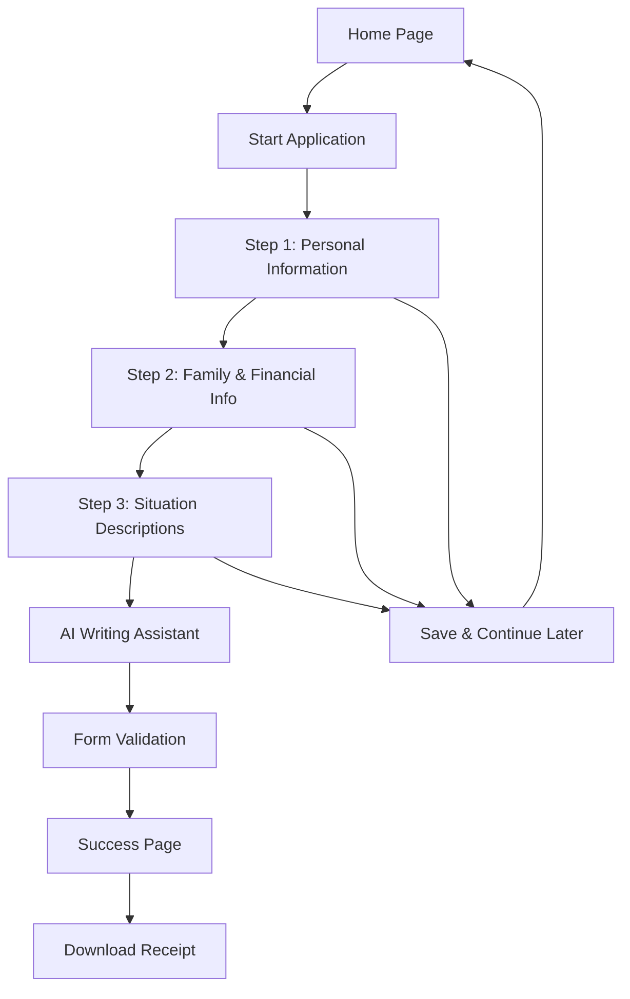

# Social Support Portal - Financial Assistance Application

A modern, AI-powered financial assistance application built with React.js and TypeScript. This comprehensive portal allows users to apply for financial assistance through a guided multi-step process with intelligent writing assistance powered by OpenAI.

## 🚀 Tech Stack

- **Framework**: React.js 18 with TypeScript
- **Build Tool**: Vite
- **Styling**: Tailwind CSS with responsive design
- **State Management**: Redux Toolkit
- **Routing**: React Router v6
- **Form Handling**: React Hook Form with Zod validation
- **Internationalization**: React-i18next (English/Arabic with RTL support)
- **AI Integration**: OpenAI GPT-3.5-turbo API
- **Icons**: Lucide React
- **Notifications**: React Hot Toast
- **Country Selection**: React Select with country list
- **Accessibility**: WCAG compliant with ARIA roles
- **Testing**: Jest & Testing Library
- **Linting**: ESLint with TypeScript rules
- **Git Hooks**: Husky for pre-commit validation

## 📁 Project Structure

```
social-support-app/
├── public/                 # Static assets
├── src/
│   ├── components/         # Reusable UI components
│   │   ├── stepper/        # Multi-step form components
│   │   ├── Button.tsx      # Custom button component
│   │   ├── Input.tsx       # Form input component
│   │   ├── Select.tsx      # Form select component
│   │   ├── Textarea.tsx    # Form textarea component
│   │   ├── CountrySelect.tsx # Country dropdown component
│   │   ├── HelpMeWriteButton.tsx # AI assistance button
│   │   ├── AISuggestionModal.tsx # AI suggestion popup
│   │   └── SaveContinueLaterButton.tsx # Save functionality
│   ├── pages/             # Page components
│   │   ├── Home.tsx       # Landing page
│   │   ├── Success.tsx    # Application success page
│   │   └── steps/         # Form step components
│   │       ├── PersonalInformation.tsx
│   │       ├── FamilyFinancialInfo.tsx
│   │       └── SituationDescriptions.tsx
│   ├── layout/            # Layout components
│   │   ├── Header.tsx     # Application header
│   │   ├── Footer.tsx     # Application footer
│   │   └── Layout.tsx     # Main layout wrapper
│   ├── services/          # API services and utilities
│   │   └── openai.ts      # OpenAI API integration
│   ├── store/             # Redux store and slices
│   │   ├── index.ts       # Store configuration
│   │   ├── hooks.ts       # Typed Redux hooks
│   │   └── slices/        # Redux slices
│   │       └── applicationSlice.ts # Application state
│   ├── schemas/           # Zod validation schemas
│   │   ├── personalInformation.ts
│   │   ├── familyFinancialInfo.ts
│   │   └── situationDescriptions.ts
│   ├── contexts/          # React contexts
│   │   └── StepValidationContext.tsx
│   ├── constants/         # Application constants
│   │   └── paths.ts       # Route constants
│   ├── i18n/              # Internationalization
│   │   ├── index.ts       # i18n configuration
│   │   └── locales/       # Translation files
│   │       ├── en.json    # English translations
│   │       └── ar.json    # Arabic translations
│   ├── types/             # TypeScript type definitions
│   ├── utils/             # Utility functions
│   │   └── cn.ts          # Class name utility
│   └── vite-env.d.ts      # Vite environment types
├── .husky/                # Git hooks
├── package.json
├── tsconfig.json
├── tailwind.config.js
├── vite.config.ts
├── .env.example           # Environment variables template
└── README.md
```

## 🛠️ Installation

1. **Clone the repository**
   ```bash
   git clone <repository-url>
   cd social-support-app
   ```

2. **Install dependencies**
   ```bash
   npm install
   ```

3. **Set up environment variables**
   ```bash
   cp .env.example .env
   ```
   Edit `.env` file with your configuration values.

4. **Start the development server**
   ```bash
   npm run dev
   ```

## 📜 Available Scripts

- `npm run dev` - Start development server
- `npm run build` - Build for production
- `npm run preview` - Preview production build
- `npm run lint` - Run ESLint
- `npm test` - Run tests
- `npm run test:watch` - Run tests in watch mode
- `npm run test:coverage` - Run tests with coverage

## 🌍 Environment Variables

Create a `.env` file in the root directory with the following variables:

```env
# OpenAI Configuration (Optional - app works with mock responses if not provided)
VITE_OPENAI_API_KEY=your_openai_api_key_here

# App Configuration
VITE_APP_NAME=Social Support Portal
VITE_APP_VERSION=1.0.0

# Feature Flags
VITE_ENABLE_ANALYTICS=false
VITE_ENABLE_DEBUG=true
```

## 🎨 Features

### 📋 **Multi-Step Application Process**
- **Step 1**: Personal Information (Name, ID, Contact details, Address)
- **Step 2**: Family & Financial Information (Marital status, Dependents, Employment, Income, Housing)
- **Step 3**: Situation Descriptions (Financial situation, Employment circumstances, Reason for applying)

### 🤖 **AI-Powered Writing Assistant**
- **OpenAI Integration**: GPT-3.5-turbo powered writing suggestions
- **Smart Prompts**: Context-aware prompts for each form field
- **Multi-language AI**: Works in both English and Arabic
- **Interactive Modal**: Accept, edit, or discard AI suggestions
- **Mock Mode**: Works without API key using realistic mock responses

### 🌍 **Internationalization & Accessibility**
- **Dual Language Support**: English and Arabic with full RTL support
- **WCAG Compliant**: Screen reader friendly with proper ARIA roles
- **Keyboard Navigation**: Full keyboard accessibility
- **Responsive Design**: Mobile, tablet, and desktop optimized
- **High Contrast**: Supports high contrast mode and reduced motion

### 📱 **User Experience**
- **Progress Tracking**: Visual stepper with progress indication
- **Form Validation**: Real-time validation with Zod schemas
- **Save & Continue**: Save progress and continue later
- **Success Page**: Complete application summary with download receipt
- **Toast Notifications**: User-friendly feedback messages
- **Error Handling**: Graceful error handling with fallbacks

### 🔧 **Technical Features**
- **Type Safety**: Full TypeScript support with strict mode
- **State Management**: Redux Toolkit for centralized state
- **Form Handling**: React Hook Form with Zod validation
- **Modern UI**: Clean, professional government-style design
- **Component Library**: Reusable, accessible components
- **Git Hooks**: Pre-commit linting and testing
- **Build Optimization**: Vite for fast development and builds

## 🔧 Configuration

### Tailwind CSS
The project uses Tailwind CSS for styling. Configuration can be found in `tailwind.config.js`.

### TypeScript
TypeScript configuration is in `tsconfig.json` with strict mode enabled.

### Vite
Build tool configuration is in `vite.config.ts` with React plugin and path aliases.

### ESLint
Linting rules are configured in `.eslintrc.cjs`.

## 🌐 Internationalization

The app supports multiple languages using react-i18next with full RTL support:

- **English** (default) - Left-to-right layout
- **Arabic** - Right-to-left layout with proper text direction

### Translation Structure
```
src/i18n/locales/
├── en.json    # English translations
└── ar.json    # Arabic translations
```

### Key Features
- **Dynamic Language Switching**: Switch between languages instantly
- **RTL Layout Support**: Proper right-to-left layout for Arabic
- **Form Validation**: Translated error messages
- **AI Prompts**: Language-specific AI prompts for better suggestions
- **Date Formatting**: Locale-aware date formatting

## 🧪 Testing

The project is configured with Jest and Testing Library for unit and integration testing.

```bash
# Run all tests
npm test

# Run tests in watch mode
npm run test:watch

# Generate coverage report
npm run test:coverage
```

## 📦 Building for Production

```bash
npm run build
```

The built files will be in the `dist` directory.

## 🤖 AI Integration

### OpenAI Configuration
The application integrates with OpenAI's GPT-3.5-turbo model to provide writing assistance:

```typescript
// Example API call
const response = await generateAISuggestion({
  fieldType: 'currentFinancialSituation',
  language: 'en',
});
```

### Features
- **Smart Prompts**: Context-aware prompts for each form field
- **Multi-language**: Supports both English and Arabic prompts
- **Error Handling**: Graceful fallbacks when API is unavailable
- **Mock Mode**: Works without API key using realistic responses

### Setup
1. Get your OpenAI API key from [OpenAI Platform](https://platform.openai.com/)
2. Add it to your `.env` file: `VITE_OPENAI_API_KEY=your_key_here`
3. The app will automatically use the API when available

## 📊 Application Flow



## 🎯 Key Components

### Form Components
- **Input**: Text, email, tel, date inputs with validation
- **Select**: Dropdown with options and validation
- **Textarea**: Multi-line text with character count
- **CountrySelect**: Searchable country dropdown
- **Button**: Reusable button with variants and icons

### AI Components
- **HelpMeWriteButton**: Triggers AI writing assistance
- **AISuggestionModal**: Interactive modal for AI suggestions

### Layout Components
- **Header**: Navigation with language toggle
- **Footer**: Contact information and links
- **Stepper**: Multi-step progress indicator
- **Layout**: Main application wrapper

## 🔒 Security & Privacy

- **No Data Storage**: All form data is stored locally in Redux state
- **API Security**: OpenAI API key is handled client-side (for demo purposes)
- **Form Validation**: Client-side validation with Zod schemas
- **Type Safety**: Full TypeScript coverage prevents runtime errors

## 🚀 Performance

- **Bundle Size**: Optimized with Vite tree-shaking
- **Code Splitting**: Dynamic imports for better performance
- **Image Optimization**: Optimized assets and icons
- **Caching**: Proper HTTP caching headers

## 🧪 Testing Strategy

```bash
# Unit Tests
npm test -- Input.test.tsx

# Integration Tests  
npm test -- PersonalInformation.test.tsx

# E2E Tests (if implemented)
npm run test:e2e
```

## 📱 Browser Support

- **Modern Browsers**: Chrome 90+, Firefox 88+, Safari 14+, Edge 90+
- **Mobile**: iOS Safari 14+, Chrome Mobile 90+
- **Features**: ES2020, CSS Grid, Flexbox, CSS Custom Properties

## 🙏 Acknowledgments

- **React.js** team for the amazing framework
- **Tailwind CSS** for the utility-first CSS framework
- **OpenAI** for AI capabilities and API access
- **Lucide** for beautiful, consistent icons
- **Zod** for runtime type validation
- **Redux Toolkit** for state management
- **React Hook Form** for form handling
- **All contributors and maintainers**

---

**Built with ❤️ for accessible, AI-powered government services** 🎉
